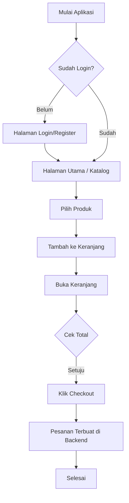

# Diagram Aplikasi Bakery

## 1. Use Case Diagram

```mermaid
usecaseDiagram
    actor Pelanggan as "Pelanggan"
    actor Admin as "Admin (Sistem)"

    Pelanggan --> (Login / Register)
    Pelanggan --> (Melihat Katalog)
    Pelanggan --> (Filter Kategori)
    Pelanggan --> (Tambah ke Keranjang)
    Pelanggan --> (Checkout Pesanan)
    
    (Checkout Pesanan) --> Admin : "Kirim Data Pesanan"
    Admin --> (Kurangi Stok Inventaris)
    Admin --> (Update Status Pesanan)
```

## 2. Flowchart Proses Pemesanan


